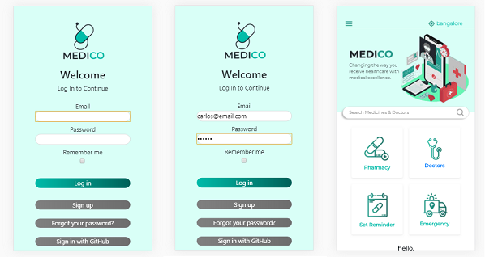
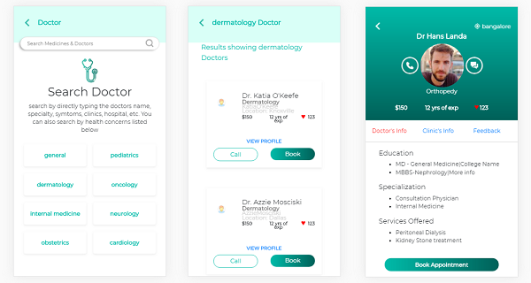
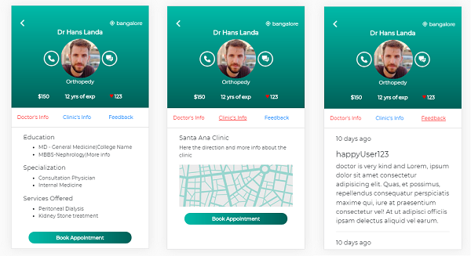
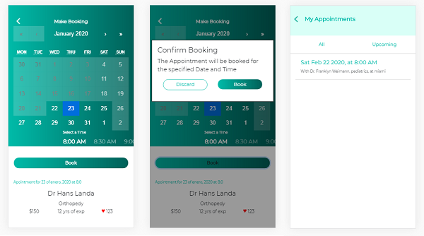

# Doctor's Appointments

This is a Doctor's Appointment application that is intended to show some of the skills of a full-stack web developer that uses Ruby on Rails and React.

**Doctor's appointments** is a an API tied to a frontend written in react, made using the methodology and indications of the Capstone Project provided by [Microverse](https://microverse.org). This project ask us to make a industry level application to show some of the skills learnt during the course. [here](https://www.notion.so/Final-Capstone-Project-Doctor-appointments-9b345aad940b4f0a951049fcb3da159f) to see the project requirements.


## Tools used

In this project we used:
* Ruby
* Ruby on Rails Framework
* [HTML](https://www.scaler.com/topics/html/)
* CSS
* React
* Redux

# Author

This project was created by:

* Carlos Del Real [Github Account https://github.com/carloshdelreal](https://github.com/carloshdelreal)

# The Web App

The live version of this project is on [Doctor's Appointments](https://doctorscapstone.herokuapp.com/)

# Required Installations

If you want a copy of this project running on your machine you have to install:

* Ruby 2.6.5
* gem 3.0.3
* Bundler 2.1.4
* Rails 6.0.2.1
* Node v13.5.0
* React

For installation instructions follow [The Instalation Guide](https://www.tutorialspoint.com/ruby-on-rails/rails-installation)


# Instalation of This App

Once you have installed the requiered packages shown on the [Required Installations](), proceed with the following steps

Clone the Repository, the folder toy_app will be downloaded

```Shell
your@pc:~$ git clone https://github.com/carloshdelreal/doctors.git
```

Move to the downloaded folder

```Shell
your@pc:~$ cd capstone
```

install gems

```Shell
your@pc:~$ bundle install --without production
```

migrate the database

```Shell
your@pc:~$ rails db:create
your@pc:~$ rails db:migrate
```
Finally, run the test suite to verify that everything is working correctly:

```Shell
your@pc:~$ rspec
```
If the test suite passes, you'll be ready to run the app in a local server:

If you desire to create dummy data to see the apps functionallity run

```Shell
your@pc:~$ rails db:seed

```

To enable the facebook login system you have to provide two environment variables with the keys to do that you have to 
```Shell
your@pc:~$ export FACEBOOK_ID=heregoesyourfacebookappid
your@pc:~$ export FACEBOOK_KEY=heregoesyourfacebookappkey

```
lastly run the server

```Shell
your@pc:~$ rails server

```

Then, go to [http://localhost:3000/](http://localhost:3000/)

Voila!

## Doctors App Features

To view the live demo, click the [Doctor's App link](https://doctorscapstone.herokuapp.com/). You will be taken to the login page. There, you will be able to register as a new user. You may also log in using  `carlos@email.com` as your email and `foobar` as the password.

<figure class="figure">
    
</figure>

Once you log in, you will be taken to the homepage. As this is a partial implementation, only the nav bar and the Doctor’s button are currently available.

Click on Doctor and behold the doctor search bar! There, you can select a specialty and the corresponding doctors will be filtered and displayed for you. Select the doctor that you prefer.

<figure class="figure">
    
</figure>

Once you select your desired doctor, you will then be able to see information and feedback about the doctor and clinic. If you are happy with your selection, you can click on **Book Appointment**.

<figure class="figure">
    
</figure>

The most important and elaborate part of this application is the booking system, in which every doctor has a totally independent set of available appointments. You can choose the date and time for the appointment and click Book. You will then be taken to a confirmation window and voila: your appointment is arranged.

The nicest feature about this implementation is that the selected appointment will no longer be available to other users.

Once your appointment has been set, you can then go to the main men and check your booked appointments.

<figure class="figure">
    
</figure>


# License

This code is licensed under the Creative Commons Attribution CC BY therefore if you use this code partially or totally don't forget to reference.

This license lets others distribute, remix, adapt, and build upon your work, even commercially, as long as they credit you for the original creation. This is the most accommodating of licenses offered. Recommended for maximum dissemination and use of licensed materials.

# External Resources

* [How to Run react components on rails](https://www.youtube.com/watch?v=5F_JUvPq410)
* [Building Awesome react apps](http://collectiveidea.com/blog/archives/2013/06/13/building-awesome-rails-apis-part-1)

# Future Features

In the original design of this application are other modules that could be developed as the one for requiring an ambulance, or buying medication, I definitely want to implement those features.

I would like to implement a feature in which doctors can register and open their appointments, keep track of their patients and register a clinic history, as there is feedback commenting for the users to grade the doctor's service I think is important that doctors grade and register the behavior of the patients as well as theirs discipline if they recomend a diet or taking timely the medication.
